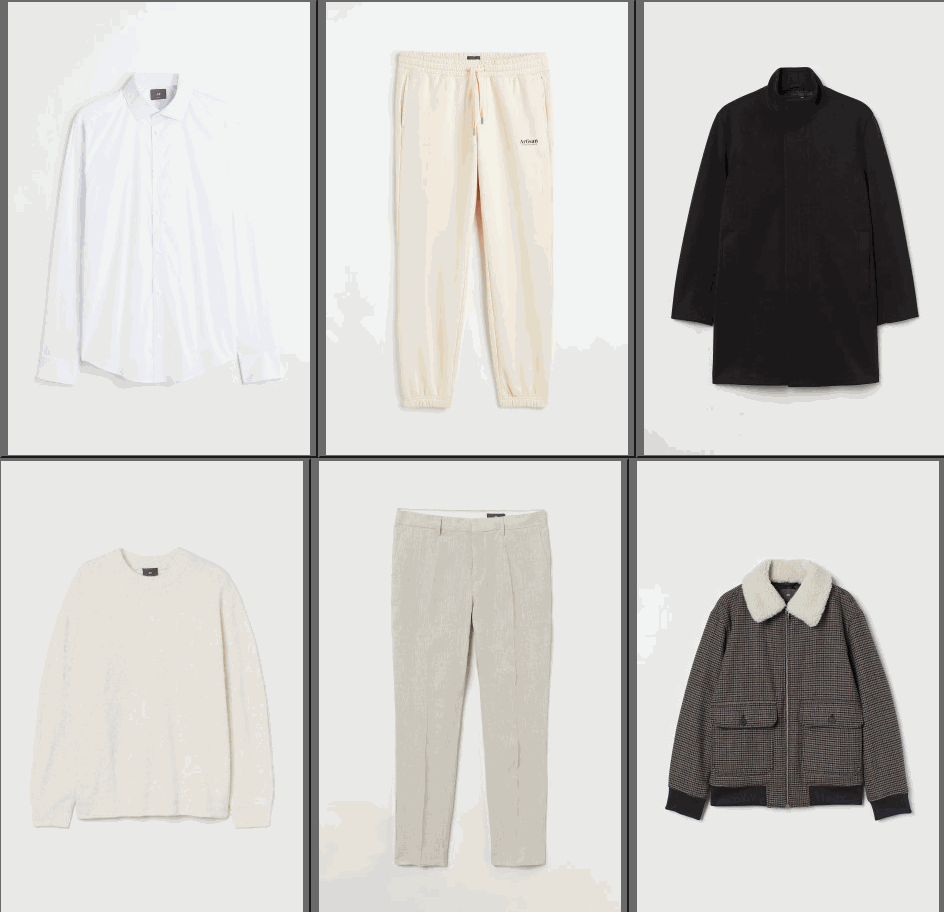

# react-flying-item

> Npm Library to make the selected item image seem to fly to top left corner (e.g: fly to cart icon)

[](https://www.npmjs.com/package/react-flying-item)
[](https://standardjs.com) 
[](https://bundlephobia.com/result?p=react-flying-item) 
[](https://www.npmtrends.com/react-flying-item) 
[](https://reactjs.org/docs/how-to-contribute.html#your-first-pull-request)


> [Demo CodePen](https://codepen.io/Ahmed_Elswerky/pen/YzLEQGj)



## Install

```bash
npm install --save react-flying-item
```

## Customizable values props

| Field Name        | Type     | Required/Optional | Default value                           | Details
| ----------------- | -------- | ----------------- | --------------------------------------- | -----------------
| targetTop         | `String` | Optional          | '5%'                                    | By default, animation ends in the top 5% 
| targetLeft        | `String` | Optional          | '5%'                                    | By default, animation ends in the left 5% 
| customAnimation   | `String` | Optional          | ''     (e.g: 20%{translate:80% 80%;})   | customizing the animation from 1% to 99%
| animationDuration | `Int`    | Optional          | 0.9                                     | By default, animations takes 0.9s to finish
| flyingItemStyling | `Object` | Optional          | { borderRadius: '4rem', width: '8rem' } | Custom style the flying item 

## Main Behavior Points

- Animation period is 900 ms
- Animation ends with Opacity 0
- Position is Fixed and values of top and left are reset from [event mouse clientX,clientY] to 5%,5%

## Usage

```jsx
import React from 'react'
import FlyingButton from 'react-flying-item'

const App = () => {
  return (
    <div>
      
      <FlyingButton src='[src-url]'>fly</FlyingButton>
    </div>
  )
}

export default App
```

## License

MIT © [Ahmed-Elswerky](https://github.com/Ahmed-Elswerky)
